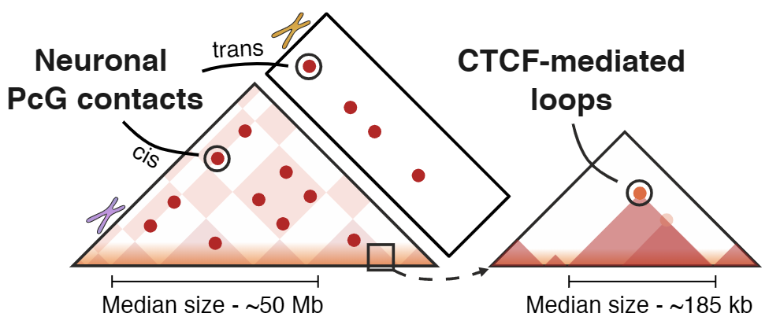

# Ultra-long-range Polycomb-coupled interactions underlie subtype identity of human cortical neurons

 This is a repository with custom code used in a [Pletenev, Vaulin et al., bioRxiv, 2025](https://doi.org/10.1101/2025.11.05.686502)

 # Dependencies
 All used *conda*-environments are listed in the `./conda_envs` folder. Each Jupiter-notebook contains a header with the path to a corresponding *conda*-environment.

 # Content
 Folder `code` contains Jupiter Notebooks for the following stages of the analysis:

 ### Data preprocessing 
Here we obtain and preprocess snm3C-seq data from Tian et al. and Heffel et al.
 - [tian2023.make_cool_from_pairs.ipynb](code/tian2023.make_cool_from_pairs.ipynb)
 - [make_clr_heffel.ipynb](code/make_clr_heffel.ipynb)

### Loop annotation 
 - [Loop annotation.ipynb](code/Loop%20annotation.ipynb)
 - [combine_dot_annotation.ipynb](code/combine_dot_annotation.ipynb)

### Polycomb in the neuronal subtypes of the *adult* human brain
Here, we conduct a reanalysis of the snm3C-seq data from Tian et al. together with the scRNA-seq data from Siletti et al., 

- [Loops_vs_Expression](code/Loops_vs_Expression), notebooks 1 - 7
- [tian2023_analysis.v2.ipynb](code/tian2023_analysis.v2.ipynb)

### Polycomb in the neuronal subtypes of the *developing* human brain
Here, we conduct a reanalysis of the snm3C-seq data from Heffel et al. together with the scRNA-seq data from Herring et al., 

- [3D_genome_in_development.Heffel2024.ipynb](code/3D_genome_in_development.Heffel2024.ipynb)
- [brain_scRNA-seq.herring2022.ipynb](code/brain_scRNA-seq.herring2022.ipynb)
- [Loops_vs_Expression](code/Loops_vs_Expression), notebooks 8 - 9

 
### ChIP-seq data analysis for Polycomb anchors
- [cgi_motifs.ipynb](code/cgi_motifs.ipynb)
- [ctcf_and_polycomb_loops_compare.ipynb](code/ctcf_and_polycomb_loops_compare.ipynb)
- [interval_clusterisation_by_chipseq_signal.ipynb](code/interval_clusterisation_by_chipseq_signal.ipynb)
- [polycomb_dots_amount_with_chipseq_signal.ipynb](code/polycomb_dots_amount_with_chipseq_signal.ipynb)

# Data 

In this paper we identified a list of 263 Polycomb anchors. The list of anchors with annotated corresponding genes is located in [data/polycomb_dot_anchors.5kb.16_06_25.csv](data/polycomb_dot_anchors.5kb.16_06_25.csv)
